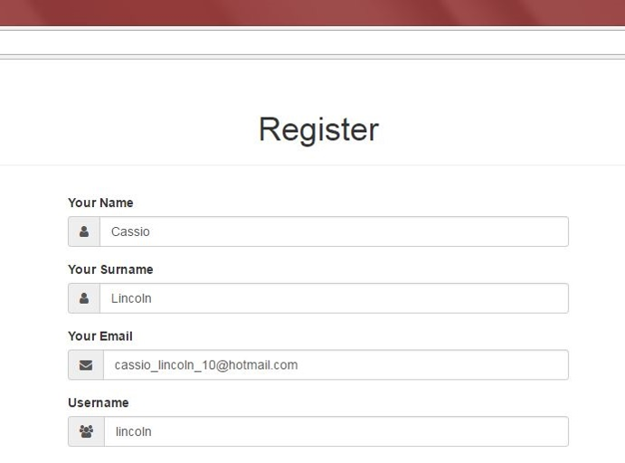
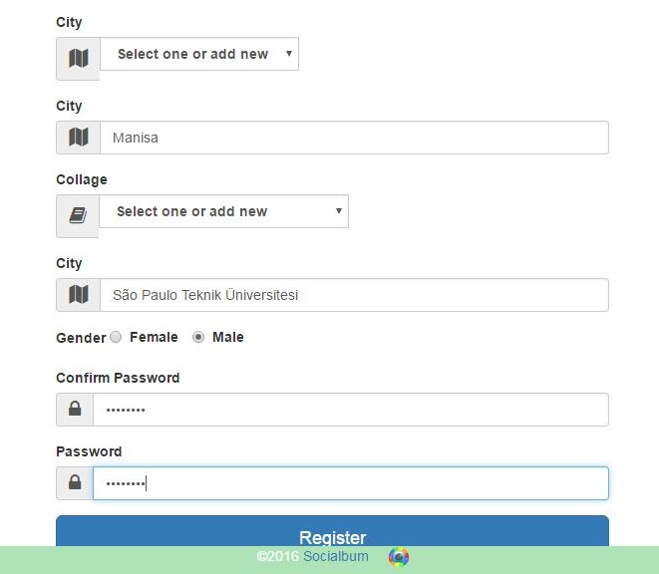
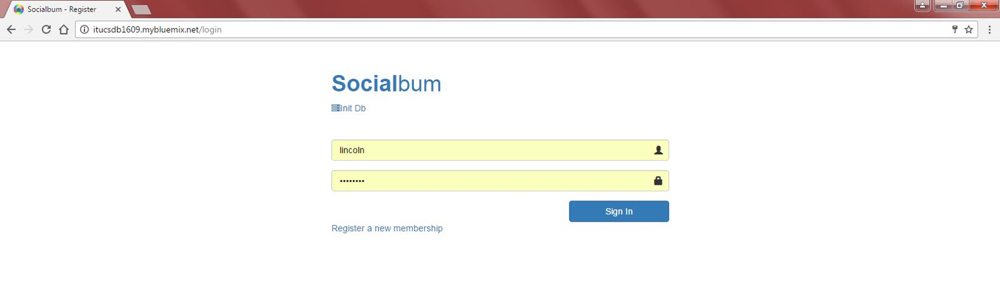
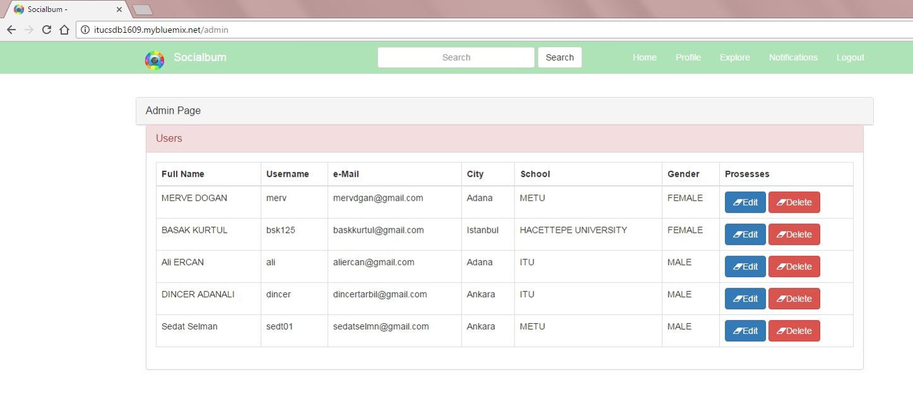
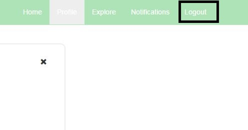

Parts Implemented by Ali ERCAN - 040090506
================================================

Login Page of Socialbum
^^^^^^^^^^^^^^^^^^^^^^^^^^^^
There is two textbox for username and password at Login page. You have to input username and password correctly at this textboxes. Since, you can only login to web site by user authentication. If you have not an account, you have to register a new membership. You can use "Register a new membership" link for create a new account.

.. figure:: mmember1_login1.png
   :scale: 80 %
   :alt: Login to site 
   :align: center

   You can easily go to Register page for create new account.

Register Page of Socialbum
^^^^^^^^^^^^^^^^^^^^^^^^^^^^
You can create an account with this page. You have to input your name, surname, email, username, city, college, gender and password information. When you registered, operation will continue with login page. 

 

   
   You created your new account and directed to login page.
   
Sign in to Socialbum with New Account
^^^^^^^^^^^^^^^^^^^^^^^^^^^^

   
   You can login successfully after register process.

Admin Panel Button
^^^^^^^^^^^^^^^^^^^^^^^^^^^^
.. figure:: member1_admin1.png
   :scale: 80 %
   :alt: Admin Panel 1  
   :align: center

   All admin users have a button at their home pages. Admin users can go to admin panel with this button.

Admin Panel
^^^^^^^^^^^^^^^^^^^^^^^^^^^^

   Admin users can change all user’s information. This operations are include update information. Besides, admins can delete user accounts.

Logout from Socialbum
^^^^^^^^^^^^^^^^^^^^^^^^^^^^
You can logout from site with logout button. If you logout, session will be end. This operation directs user to login page.

