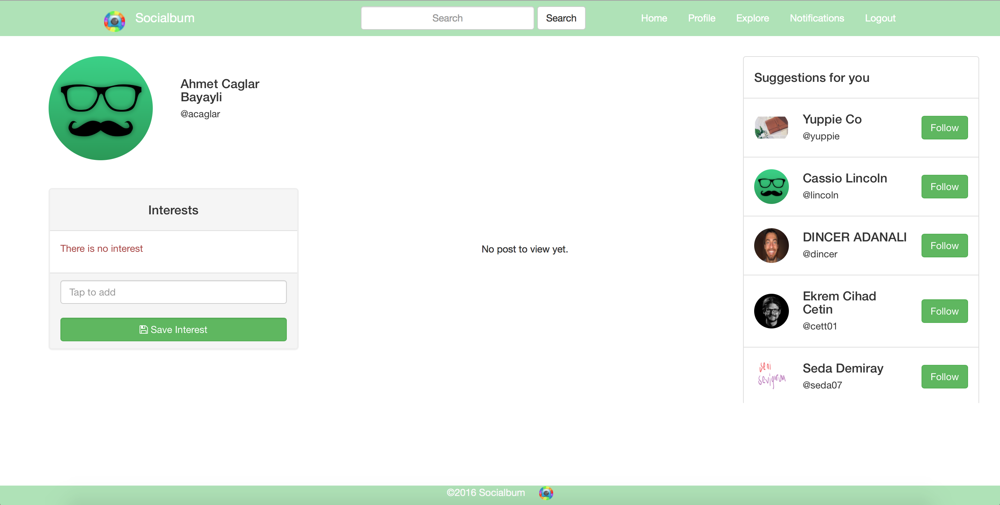
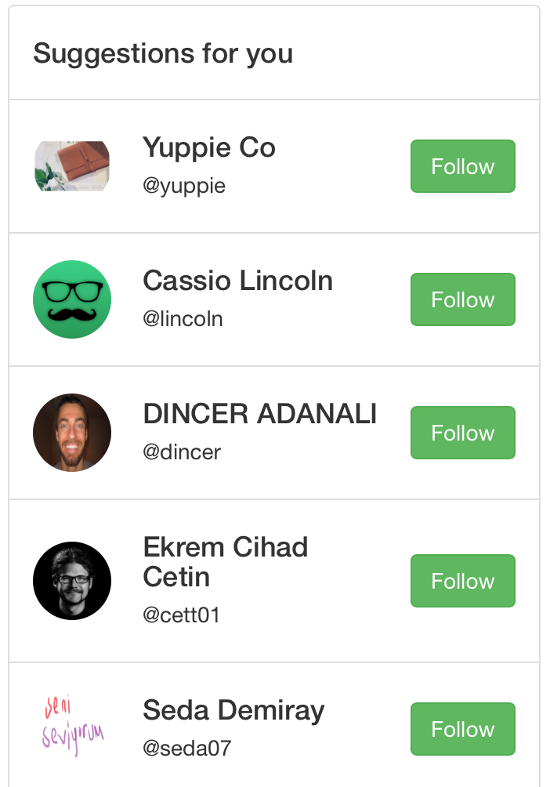
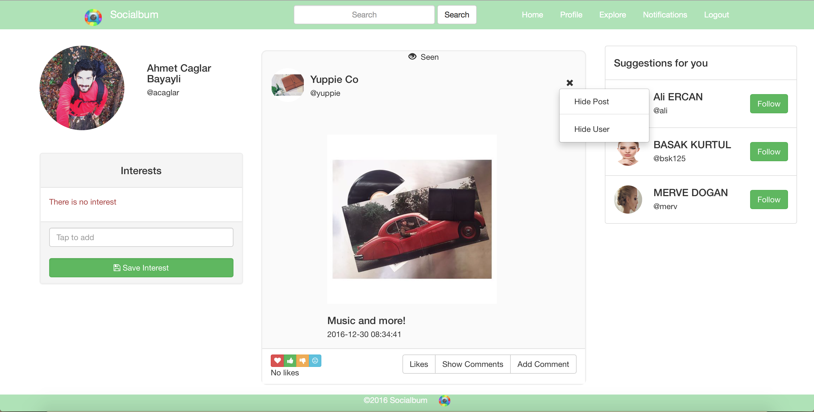
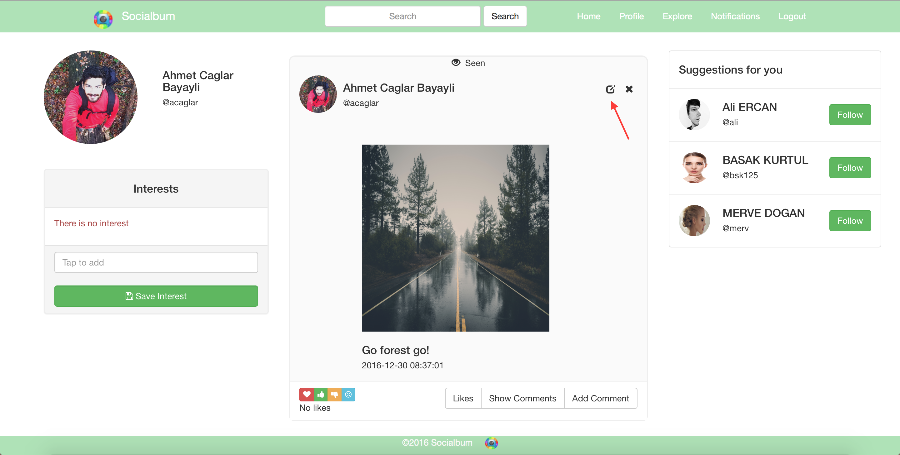
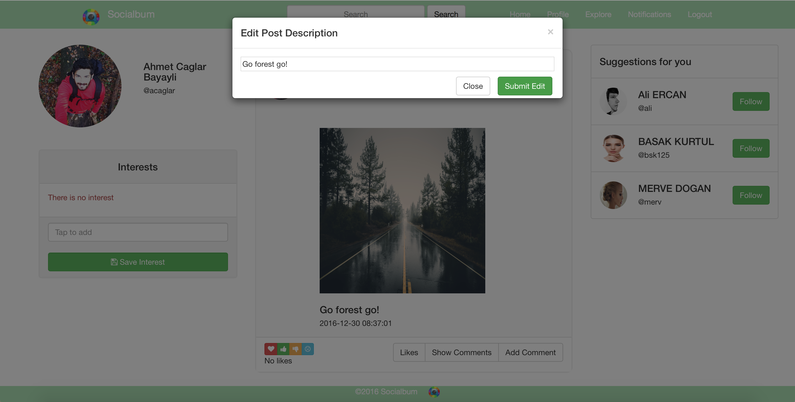
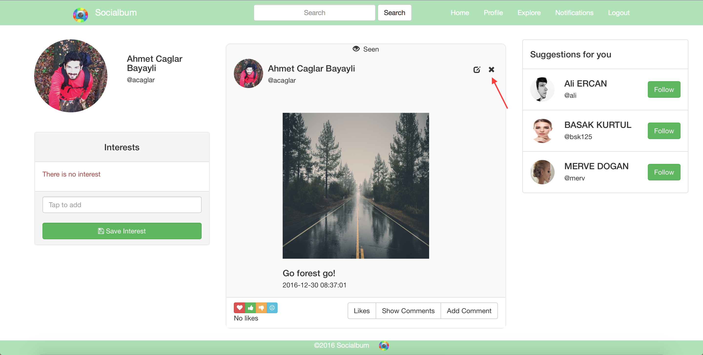
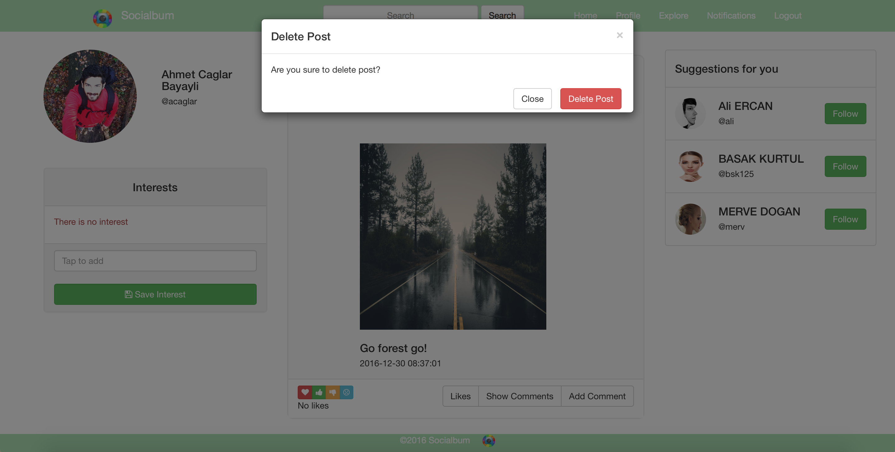
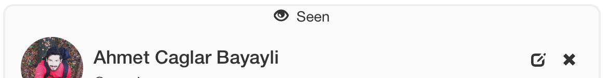

Parts Implemented by Ahmet Çağlar BAYATLI - 040100031
================================================

HOME Page
^^^^^^^^^^^^
In the home page you can see posts that shared by users who you follow.

   For a new registered user, home page will meet you with an default profile picture. But no post to view and lots of suggested users.
   
.. figure:: member3_generalviewofhomepage.png
   :scale: 80 %
   :alt: Home Page-General view
   :align: center

   After you followed someone and changed your profile picture, home page will be seen as shown above.

Follow Users From Home Page
^^^^^^^^^^^^^^^^^^^^^^^^^^
You can easily follow other user from suggested for you part of home page.

   
   Suggested for you part of home page will suggest users, who are not followed by you, but followed by users who you follow, you to follow. But if you a new registered user, Socialbum will select this suggest from all users randomly.

Hidden Users and Hidden Posts
^^^^^^^^^^^^^^^
if you do not want to see a post or all post of a user anymore, you can hide only specific post or user who share that post from your home page. 

   Just clicking on the x icon on the post and select the option "Hide Post" or "Hide User", you will not see that post or user anymore on your home page.

Home Page Post Operations
^^^^^^^^^^^^^^^^
You can see and manage your own posts from home page. You have some extra operations for your own post which you have not for other's posts.

   If you want to update your own post's description from your home page, click the edit icon of the post.

   When you click the edit icon on your post a modal pops up with a text box that current description writen in it. Then you can edit the description however you want.

   If you want to delete your own post, click the x icon of the post.

   When you click the x icon on your post a modal pops up to ask you to be sure. Then you can delete your post just clicking delete button.
   
Home Page Seen Feature
^^^^^^^^^^^^^^^^
Socialbum let you know about posts that your seen before.

   Posts which shared before your last enter the home page, will be marked with an eye icon.

Thanks for your interest for all the parts of my page, you should start using this web application to explore and learn more about. Hope you enjoy.