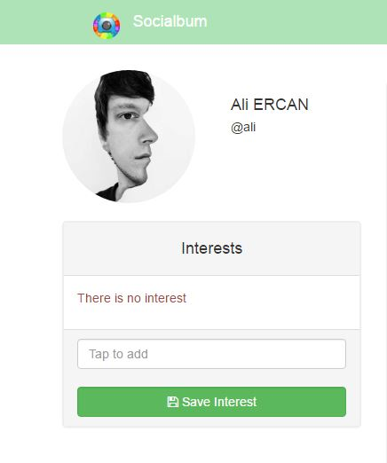
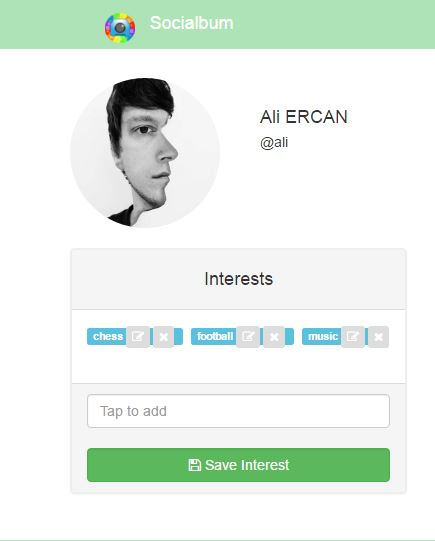
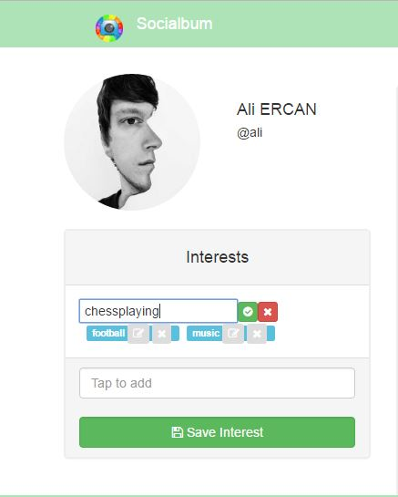
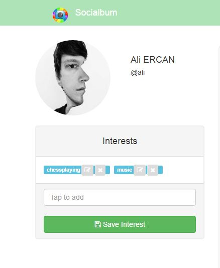
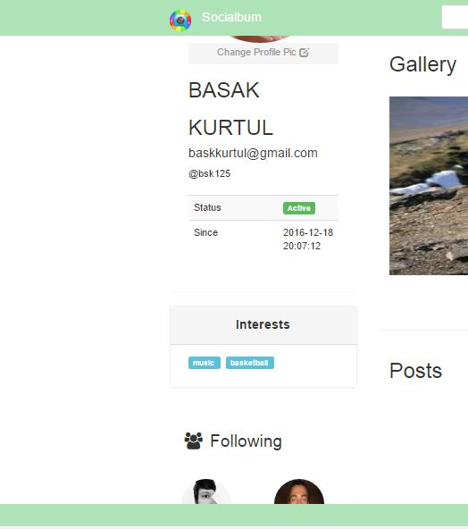
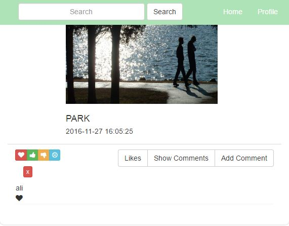
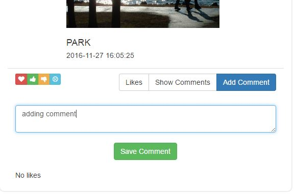
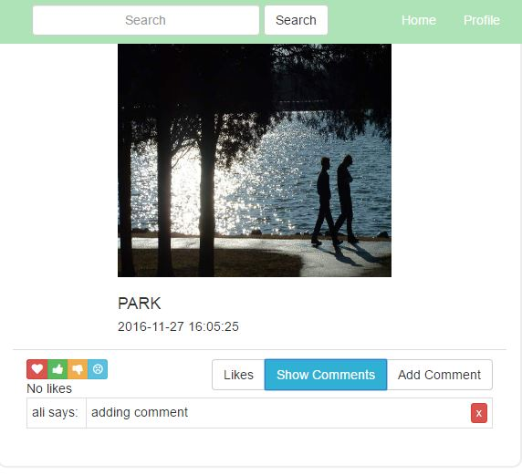
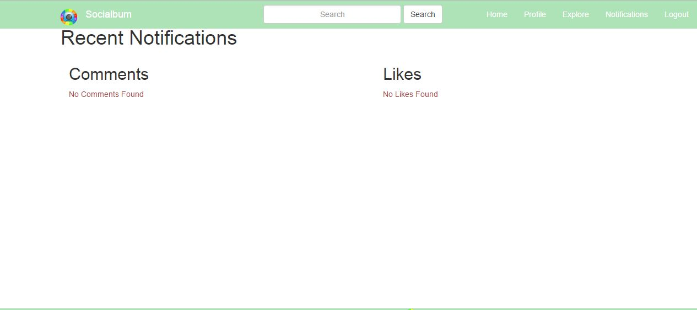
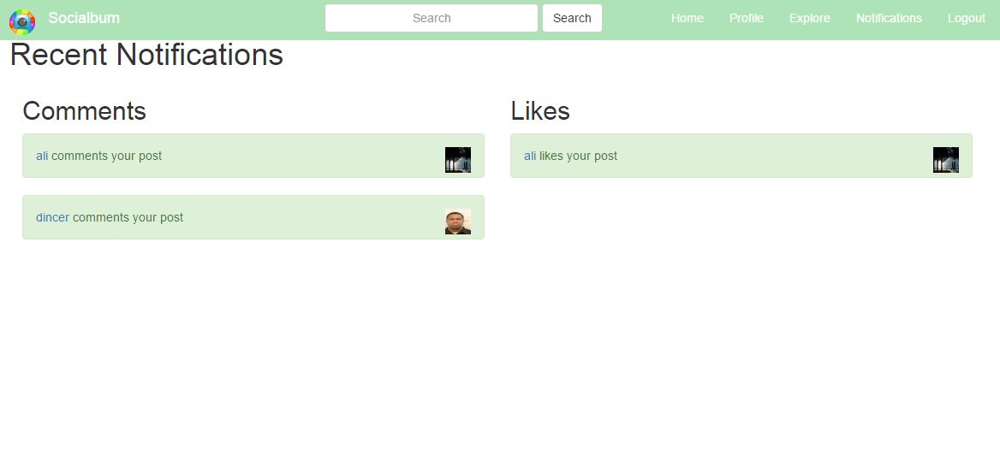

Parts Implemented by Fatih Deniz
================================

INTERESTS ON HOMEPAGE
^^^^^^^^^^^^^^^^^^^^^^

At homepage, you can see your "Interests" field. Also you can manage your interests by adding new ones or deleting and updating existings.

VIEW AFTER ADDED INTERESTS
^^^^^^^^^^^^^^^^^^^^^^^^^^^^

After you added interests on this field, they are shown as in below. 

   
   Also you can see the little buttons top-right side of the each interest and these are used for update and delete operations.
   
   UPDATE INTERESTS
^^^^^^^^^^^^^^^^^^^^^^^^^^^^

You can update your interests using update button and it is shown as in below. 

   
   After you update your interest you can cancel this operation using cross button or you can save it using green tick sign.
   
   
     DELETE INTERESTS
^^^^^^^^^^^^^^^^^^^^^^^^^^^^

You can delete your interests using delete button and it will not appear anymore on your interests. 

   
  As an example "football" interest is deleted.
  
     INTERESTS ON PROFILE PAGE
^^^^^^^^^^^^^^^^^^^^^^^^^^^^^^^^^^

Interest field takes place also at your profile page.

   
  Here, you can just view the interests; but you can't make any changes.
  
    LIKE BUTTONS
^^^^^^^^^^^^^^^^^^^^^^^^^^^^^^^^^^

At homepage, you can like your followings' post using like buttons.

   
  You can also view who likes that post using "Likes" button.
  
    ADDING A COMMENT
^^^^^^^^^^^^^^^^^^^^^^^^^^^^^^^^^^

You can make a comment on a post that you can view on your homepage. 

   
  After you made your comment you can send it using "Save" button that exists in below.
  
    SHOW COMMENTS
^^^^^^^^^^^^^^^^^^^^^^^^^^^^^^^^^^

You can view the comments using "Show Comments" button.  

   
  If you are owner a comment, you can also delete it using red cross sign.
  
  
      NOTIFICATIONS PAGE WITH NO ACTION
^^^^^^^^^^^^^^^^^^^^^^^^^^^^^^^^^^^^^^^^

After you get any like or comment these actions are listed on your notifications page. Here is a view when not any likes or comments exist for the user. 

   
  
        NOTIFICATIONS PAGE WITH LIKES AND COMMENTS
^^^^^^^^^^^^^^^^^^^^^^^^^^^^^^^^^^^^^^^^^^^^^^^^^^

After you get any like or comment these actions are listed on your notifications page. Here there are two comments and one like and this site is shown as below.

   
   
  
  
  
  
  
  
  
  
  
  
  
  
  
  
  
  
  
  
  
  
  
  
  
  
  
   

