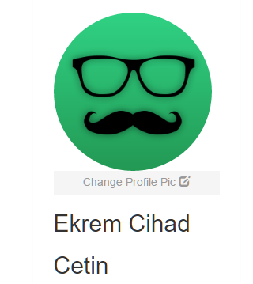
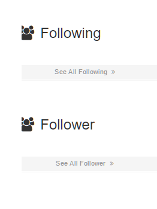

Parts Implemented by Mehmet Dinçer Bozdoğan 040080222
================================================

Explore Page and Favourites
^^^^^^^^^^^^^^^^^^^^^^^^^^^
In the Explore page, you can see to hashtags, and if you click on a hashtags, you will see the all photos with that hashtag ordered by the added date. 
In your own profile page, you can add a new hashtag, delete and hashtag or update an hashtag under your post. 

.. figure:: member5_addanewhashtag.png
   :scale: 80 %
   :alt: Add an hashtag for your post 
   :align: center

   This page and this default avatar profile picture are for registered new user. Posts and follow sections are blank

Profile Picture Processes
^^^^^^^^^^^^^^^^^^^^^^^^^^
The profile of the newly registered user on the site can be changed with the "Change Profile Pic" button on the upper left.

With the modal that comes after the button click, you can set the URL of the image you want and change the profile picture.

.. figure:: member2_3changeprofilepicmodal.png
   :scale: 80 %
   :alt: Profile page-profile picture modal
   :align: center

   You can get the image URL you want to use with the help of routed links below.

Image Processes
^^^^^^^^^^^^^^^
You can add photos, add descriptions, add hashtags as posts.

.. figure:: member2_4addimage.png
   :scale: 80 %
   :alt: Profile page-add image
   :align: center

   The new image created by adding the URL and Description will appear with the users following you.

.. figure:: member2_5galleryimageslider.png
   :scale: 80 %
   :alt: Profile page-Gallery image slider
   :align: center

   On the "Gallery" tab you can see all the images added. You can also open the image slider by clicking on the image, you can see all the images with the help of the arrows.

.. figure:: member2_6posts.png
   :scale: 80 %
   :alt: Profile page-POSTS
   :align: center

   All photos uploaded to the site will appear as post like Instagram. Posts have got Description, comments, likes, hashtag and  date.

.. figure:: member2_7updatedelete.png
   :scale: 80 %
   :alt: Profile page-Post update Delete
   :align: center

   You can also change the properties of your posts and delete your posts.

.. figure:: member2_8updatemodal.png
   :scale: 80 %
   :alt: Profile page-Update Post
   :align: center

   You can see update post modal process above picture with new Description.

Follow Processes
^^^^^^^^^^^^^^^^

You have to follow this place to see what others share. You can look at the profile of the person with the "suggestion for you" tab on the main page.

.. figure:: member2_9followstatus.png
   :scale: 80 %
   :alt: Profile page-Follow Status
   :align: center

   When you enter someone else's page, you will see "Follow Status" on the profile picture. If you do not follow the person, "FOLLOW" will appear. If you are following, you can unfollow with the "UNFOLLOW" button.

   You can see unfollow status.

Thanks for visiting all the parts of my page, you should start by creating an account to better understand the site :)