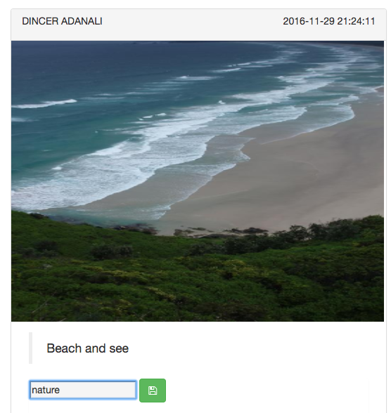
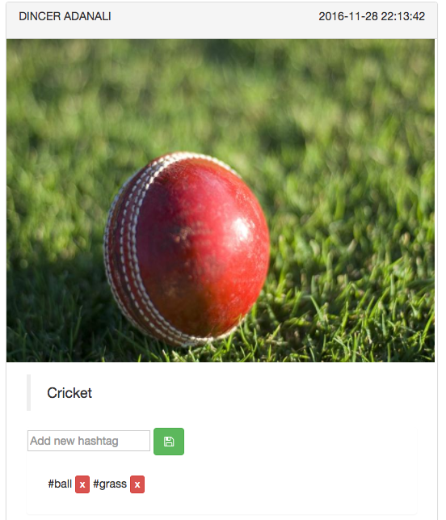
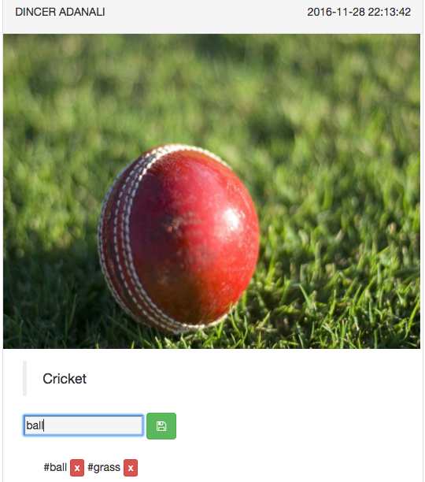
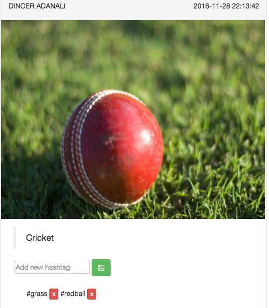
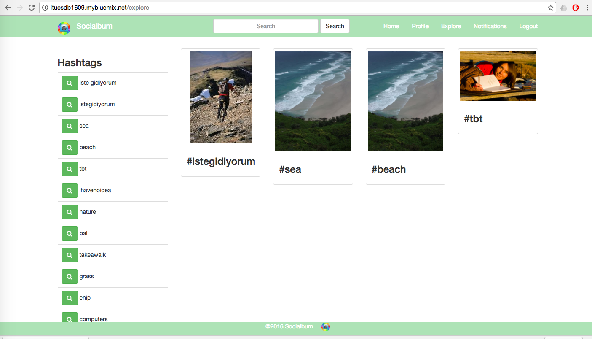
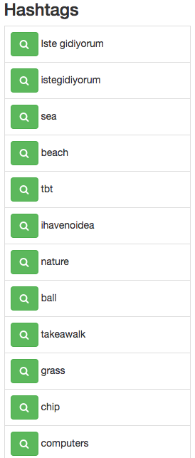
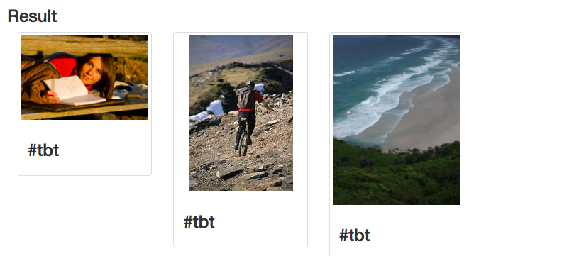
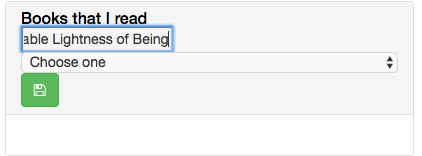
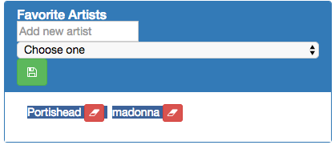
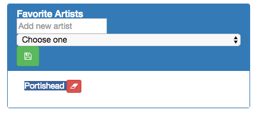

Parts Implemented by Mehmet Dinçer Bozdoğan 040080222
================================================

Explore Page And Favourites
^^^^^^^^^^^^^^^^^^^^^^^^^^^^
In the Explore page, you can see to hashtags, and if you click on a hashtags, you will see the all photos with that hashtag ordered by the added date. 
In your own profile page, you can add a new hashtag, delete and hashtag or update an hashtag under your post. If you already added a hashtag to your post but if after you decided not to use that hashtag for that post, you can easily delete a hashtag to press "X" button
You can see the all hashtags in the explore page ordered by adding date. And the most popular hashtag will be seen with a photo in the page.
You can easily add your favourite books in your profile. You can see the favourite books of your following people in their profiles.

   This button can provide owner of post to add a hashtag. 

   
   You can delete a hashtag easily.
 

   
   Update
   

   
   Update
   

   Explore
   

   You can see the hashtags left side of the page.

   
   When you click on a hashtag, you will see the all photos which has that hashtag.
 
        

   
   Add a book
   

   
   Book added
   

   
   Favourite Artist
   

   
   Favourite Artist 